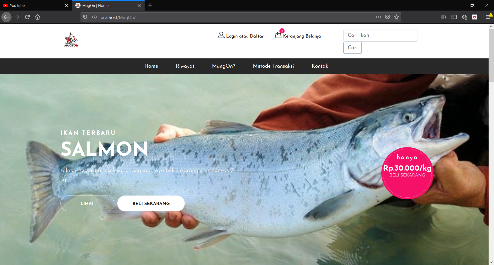
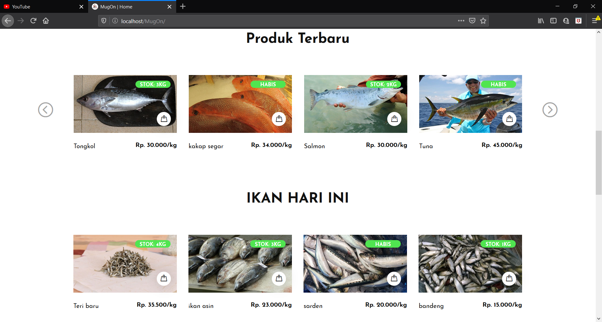
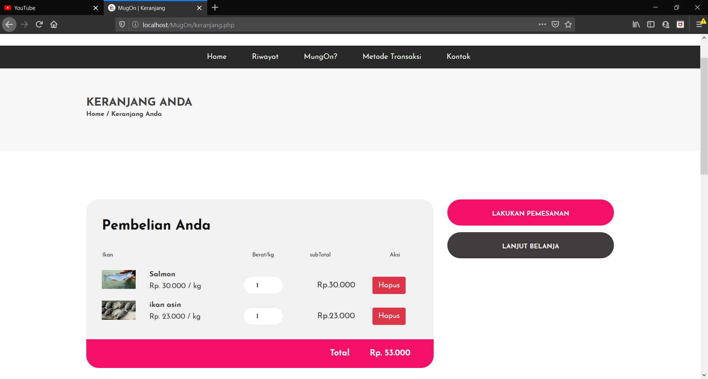
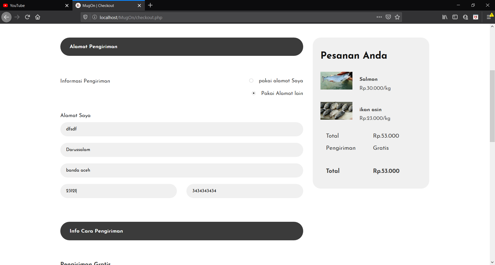
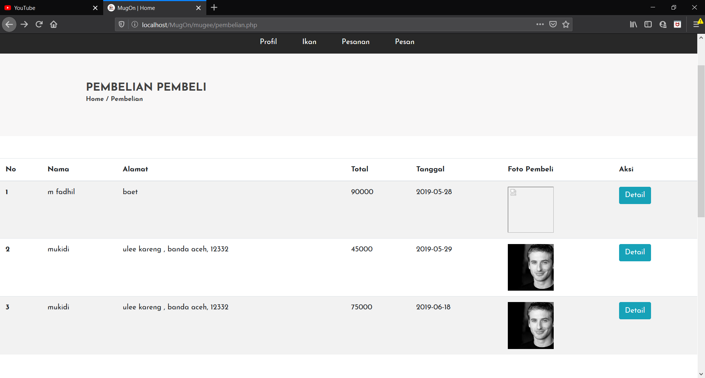
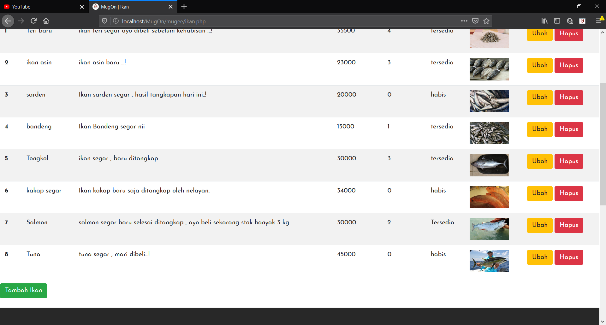
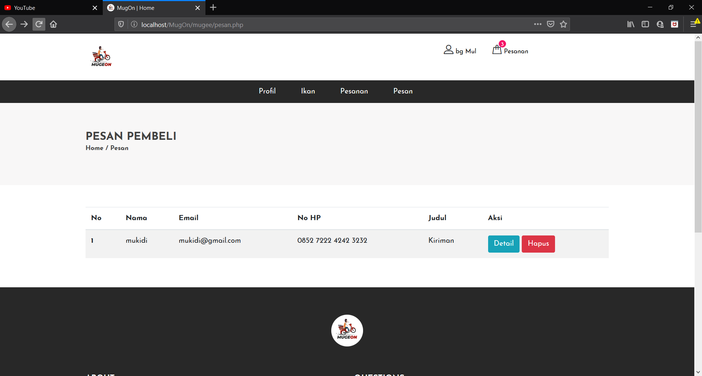

# MugOn(Mugee Online)

##### MugOn merupakan aplikasi pembelian ikan secara online yang berbasis web dengan menjadikan mugee sebagai penjual di aplikasi ini. kami memperkenalkan aplikasi MugOn(Mugee Online) dengan aplikasi mugon ini pembeli dapat membeli ikan dimana saja dan kapan saja , ikan yang dipesan oleh pembeli akan langsung diantar secepatnya oleh mugee ke alamat pembeli tersebut dan pembeli dapat melakukan pembayaran ketika ikan sudah diantarkan (Cash On Delivery).

mugee = penjual ikan keliling

## tampilan halaman
### halaman home dari pembeli

### halaman keranjang belanja

### halaman pemesanan

### halaman daftar pembelian (Mugee/admin)

### halaman daftar ikan yang dijual (Mugee/admin)

### halaman feedback dari pembeli(pesan)(halaman Mugee/admin)

### team kami

## Fitur
1.auth
2.edit profile(user/mugee(admin))
3.melakukan pemesanan ikan
4.mugee(admin) dapat menambah ikan yang dijual
5.mugee(admin) dapat mengkonfirmasi pemesanan
6.admin dapat melakukan CRUD disetiap fitur diatas
7.dll

Aplikasi jual beli ikan diatas dibuat menggunakan php native, semoga dapat membantu teman-teman sebagai referensi dalam membuat project ataupun tugas kuliah.
